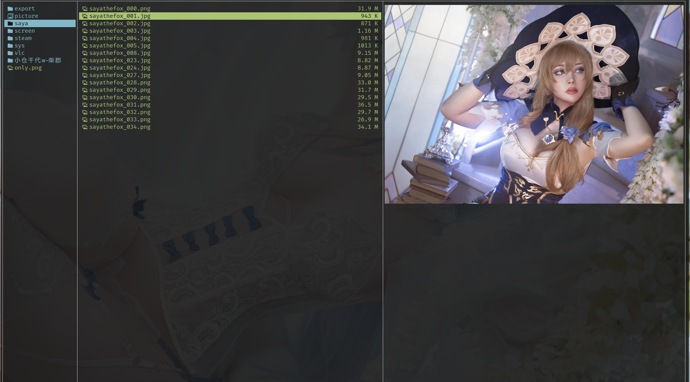

# joshuto

## 圖片預覽



1. 下載源碼

```bash
git clone --depth 1 https://github.com/jstkdng/ueberzugpp.git
```

2. 安裝依賴

```bash
yay -S cmak
yay -S libvips
yay -S libsixel
yay -S chafa
yay -S openssl
yay -S tbb
```

3. 編譯安裝

```bash
mkdir build && cd build
cmake -DCMAKE_BUILD_TYPE=Release ..
cmake --build .
```

可以通過 -D 指定的選項：

- `-DCMAKE_BUILD_TYPE=Release`：以發佈模式編譯
- `-DENABLE_X11=OFF`：關閉 X11 支持
- `-DENABLE_OPENCV=OFF`：關閉 OpenCV 支持
- `-DENABLE_TURBOBASE64=ON`：啓用 Turbo-Base64

編譯完成後把 `ueberzug ` 和 ` ueberzugpp ` 移動到 $PATH 路徑中

4. 必須軟件

```bash
yay -S perl-image-exiftool
```

5. 修改配置

新增一個 `joshuto` bash 腳本並添加到 $PATH，內容如下：

```bash
#!/usr/bin/env bash
#
## Example wrapper for using Überzug++

export joshuto_wrap_id="$$"
export joshuto_wrap_tmp="$(mktemp -d -t joshuto-wrap-$joshuto_wrap_id-XXXXXX)"
export joshuto_wrap_preview_meta="$joshuto_wrap_tmp/preview-meta"
export ueberzug_pid_file="$joshuto_wrap_tmp/pid"
export ueberzug_img_identifier="preview"
export ueberzug_socket=""
export ueberzug_pid=""


function start_ueberzugpp {
    ## Adapt Überzug++ options here. For example, remove the '--no-opencv' or set another output method.
    ueberzugpp layer --no-stdin --pid-file "$ueberzug_pid_file" --no-opencv &>/dev/null
    export ueberzug_pid="$(cat "$ueberzug_pid_file")"
    export ueberzug_socket=/tmp/ueberzugpp-"$ueberzug_pid".socket
    mkdir -p "$joshuto_wrap_preview_meta"
}

function stop_ueberzugpp {
    remove_image
    ueberzugpp cmd -s "$ueberzug_socket" -a exit
    kill "$ueberzug_pid"
    rm -rf "$joshuto_wrap_tmp"
}

function show_image {
    ueberzugpp cmd -s "$ueberzug_socket" -a add -i "$ueberzug_img_identifier" -x "$2" -y "$3" --max-width "$4" --max-height "$5" -f "$1" &>/dev/null
}

function remove_image {
    ueberzugpp cmd -s "$ueberzug_socket" -a remove -i "$ueberzug_img_identifier" &>/dev/null
}

function get_preview_meta_file {
    echo "$joshuto_wrap_preview_meta/$(echo "$1" | md5sum | sed 's/ //g')"
}

export -f get_preview_meta_file
export -f show_image
export -f remove_image
 
if [ -n "$DISPLAY" ] && command -v ueberzugpp > /dev/null; then
    trap stop_ueberzugpp EXIT QUIT INT TERM
    start_ueberzugpp
fi

joshuto "$@"
exit $?
```

添加 `~/.config/joshuto/on_preview_shown` 內容如下：

```bash
#!/usr/bin/env bash

test -z "$joshuto_wrap_id" && exit 1;

path="$1"       # Full path of the previewed file
x="$2"          # x coordinate of upper left cell of preview area
y="$3"          # y coordinate of upper left cell of preview area
width="$4"      # Width of the preview pane (number of fitting characters)
height="$5"     # Height of the preview pane (number of fitting characters)


# Find out mimetype and extension
mimetype=$(file --mime-type -Lb "$path")
extension=$(/bin/echo "${path##*.}" | awk '{print tolower($0)}')

case "$mimetype" in
    image/png | image/jpeg)
        show_image "$path" $x $y $width $height
        ;;
    *)
        remove_image
esac
```

添加 `~/.config/joshuto/on_preview_removed` 內容如下：

```bash
#!/usr/bin/env bash
test -z "$joshuto_wrap_id" && exit 1;
remove_image
```

修改 `joshuto.toml` preview 結點下的內容，兩個腳本指向真實的腳本地址：

```toml
[preview]
...
preview_shown_hook_script = "~/.config/joshuto/on_preview_shown"
preview_removed_hook_script = "~/.config/joshuto/on_preview_removed"
```

## 訪問剪貼板失敗

如果 `yn` 等命令無法複製路徑名可以安裝 `xclip` 解決，如果是 kde 桌面則可以使用 `clipman` / `cliphist`。

```bash
yay -S xclip
```
